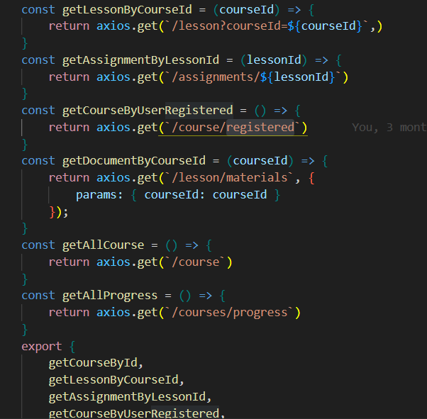

# n8n-health

Monorepo with a Django backend and a React frontend (Vite).

Structure:

- backend/  (Django project)
- frontend/ (Vite + React)

Requirements
- Python 3.10+ recommended
- node 18+ recommended

Quick start

Backend

```bash
cd backend
python -m venv .venv
source .venv/bin/activate
pip install -r requirements.txt
python manage.py migrate
python manage.py runserver 0.0.0.0:8000
```

Frontend

```bash
cd frontend
npm install
npm run dev
```

Add API in FrontEnd 
- Folder services
- Add API in appropriate file
- Example file API:  

The frontend will call the backend API at `http://localhost:8000/api/health/`.

Project files (important)

- `backend/requirements.txt` - Python dependencies for Django backend
- `backend/manage.py` - Django management entrypoint
- `backend/backend/settings.py` - Django settings
- `backend/api/` - simple Django app exposing `/api/health/`
- `frontend/` - Vite + React app that proxies `/api` to the backend

Notes

- When running frontend with `npm run dev`, Vite proxies `/api` to `http://localhost:8000` as configured in `vite.config.js`.
- You can change the backend host/port by setting `DJANGO_DEBUG=0` and `DJANGO_SECRET` environment variables for production usage.

If you want, I can also create a Docker Compose configuration to run both services together.
